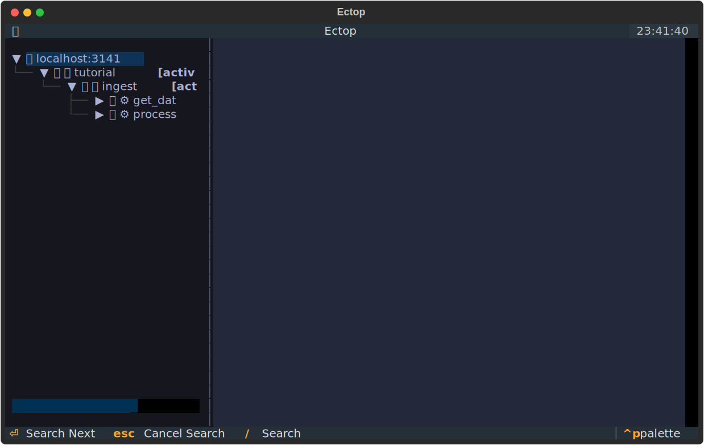

# Tutorial: Getting Started with ectop

This tutorial will guide you through using `ectop` to monitor and manage a sample ecFlow suite.

## Prerequisites

1.  **ecFlow Server**: Ensure you have an ecFlow server running. You can start one locally with:
    ```bash
    export ECF_PORT=3141
    export ECF_HOME=$HOME/ecflow_home
    mkdir -p $ECF_HOME
    ecflow_server
    ```
2.  **ectop**: Installed and ready to use.

## Step 1: Create and Load the Tutorial Suite

We have provided an example suite in `examples/tutorial_suite.py`. This suite simulates a simple data processing workflow with dependencies.

1.  **Generate the definition file**:
    ```bash
    python examples/tutorial_suite.py
    ```
    This will create a `tutorial.def` file.

2.  **Load the suite into your server**:
    ```bash
    ecflow_client --port 3141 --load tutorial.def
    ```

3.  **Begin play**:
    ```bash
    ecflow_client --port 3141 --begin tutorial
    ```

## Step 2: Launch ectop

Now, start `ectop` to monitor the suite:

```bash
ectop
```

You should see the `tutorial` suite in the tree on the left.



## Step 3: Monitoring and Interaction

### The Status Bar
At the bottom of the screen, you will find the **Status Bar**. This provides critical information at a glance:
- **Server**: The host and port you are connected to.
- **Version**: The version of the ecFlow server (e.g., `v5.11.4`).
- **Status**: The scheduling state of the server (e.g., `RUNNING` or `HALTED`).
- **Last Sync**: The exact time of the last successful synchronization with the server.

### The Tree View
The left sidebar shows the hierarchy of your suite. You can use the arrow keys to navigate and `Enter` to expand or collapse nodes. Icons next to node names indicate their current state (e.g., 🟢 for complete, 🔥 for active).

### Viewing Files
Select a task (e.g., `tutorial/ingest/get_data`) and press `l`. `ectop` will fetch the script, the generated job, and any available log output, displaying them in the tabs on the right.

### Managing Nodes
Try suspending a family or task:
1.  Select the `analysis` family.
2.  Press `s` to **Suspend**. You will see the icon change to 🟠.
3.  Press `u` to **Resume**.

### Live Log Updates
If a task is running (Active 🔥), you can toggle live log tailing by pressing `t`. The `Output` tab will periodically refresh with new data from the server.

### Why is it queued?
If a node is not running when you expect it to, select it and press `w`. The **Why Inspector** will show you the triggers or dependencies that are currently blocking it. This view recursively parses trigger expressions, highlighting exactly which parts of the logic are unmet.

### Finding Nodes
In large suites, finding a specific task can be difficult. Press `/` to open the **Search Box**. As you type, `ectop` will perform a live search across all nodes in the suite. Press `Enter` to jump to and select the next matching node.

### Filtering by Status
You can filter the tree to show only nodes in a specific state by pressing `F` (**Shift + F**). This cycles through filters like:
- **Aborted**: Focus only on failed tasks.
- **Active**: See what is currently running.
- **Suspended**: Find paused parts of the workflow.
- **All**: Clear all filters.

The current filter is displayed in the tree root label.

### Managing Variables
Press `v` to open the **Variable Tweaker**.
- **User Variables**: Defined specifically on this node.
- **Generated Variables**: Automatic ecFlow variables (like `ECF_TRYNO`).
- **Inherited Variables**: Variables defined on parent families or the suite itself.

To override an inherited variable, simply add a new variable with the same name to the current node.

### The Command Palette
If you forget a keybinding, press `p` to open the **Command Palette**. This searchable interface allows you to execute any action by name (e.g., type "halt" to find the "Halt Server" command).

## Step 4: Editing Scripts on the Fly

One of `ectop`'s most powerful features is the ability to edit scripts directly.

1.  Select a task.
2.  Press `e`.
3.  Your default editor (defined by `$EDITOR`) will open with the script content.
4.  Make a change and save.
5.  `ectop` will prompt you if you want to update the script on the server and optionally **Requeue** the task to run the new version.

## Next Steps

Explore the [Architecture](architecture.md) page to learn how `ectop` works under the hood, or check the [Reference](reference.md) for a full list of keybindings.
